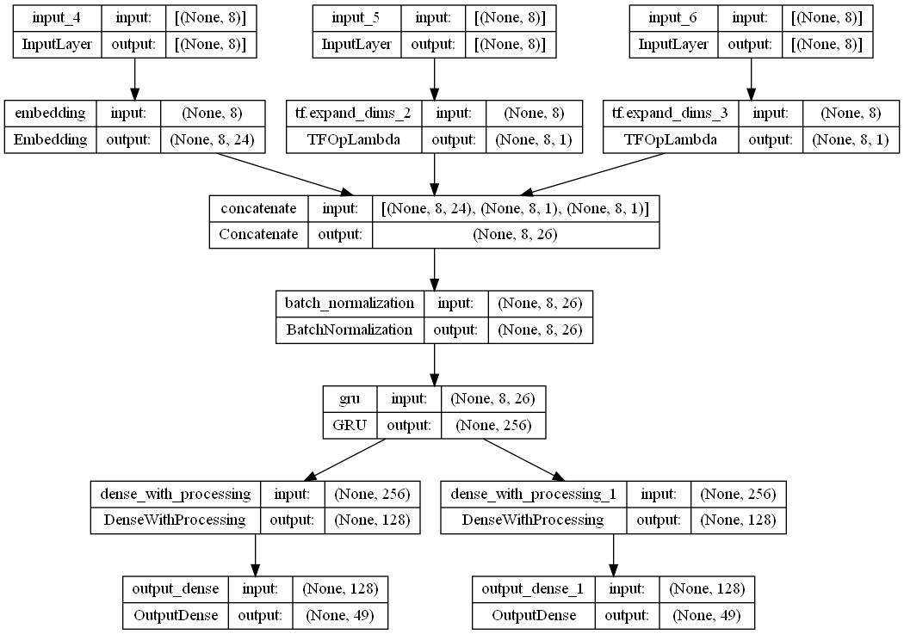
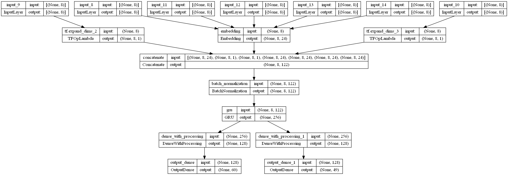

# Jazz Neural Network
A neural net that is able to write jazz standards in the style of the Real Book.

## General information
The project consists of two neural networks that work together to write jazz songs
in the style of the Real Book:
- A neural network that writes the harmony, i.e. the chords
- A neural network that writes some melody over the harmony

The networks are trained on the Real Book, a corpus of songs that comprise well-known
Jazz songs, so called "Standards".

When predicting, one can pass either an actual Real Book song (either a specific one or
a random one) or a self-composed snippet as the input. First, the harmony network will
write some harmony for the amount of measures that are passed as a parameter. Then, the
melody network will write some melody that fits the chords. For both prediction
processes, BeamSearch is used (see below). Finally, the predictions are combined into
a .xml file that can be read by using music notation software.

## Problem/ Modeling approach
Both networks are **Recurrent Neural Networks** that aim to predict the next note/
chord, given previous notes/ chords.

In order to achieve this, the respective network is given sequences of notes/ chords
of a fixed length as input and has to predict the next note/ chord as a
**classification problem** where each note/ chord is one "category". The network has
to learn which of the 60 notes or 48 chords (see below for explanation) it has to
choose. The loss that is used is Categorical Crossentropy Loss.

During prediction, the network is fed the end of a song (the so-called "Turnaround") and
then has to predict the next note/ chord, i.e. the beginning of the song.
It is then iteratively fed with *its own predictions* until the specified number of
measures is written. This means that the Network iteratively writes a song.

As already stated, the harmony is written first, followed by the melody which is written
"on top" of the harmony.

## Data Preprocessing

### 1.) Transformation of notes into NN-compatible format

To transform music into a problem that a neural network can solve, some preprocessing
is necessary: Each song first needs to be converted a numerical representation that
the network can handle. For this purpose, the `Note` and `Chord` classes from
the `rnn.music.musical_elements` module are used.

Both the `Note` and `Chord` classes have three main properties:
* The **pitch height**, represented in MIDI-format. The MIDI-format is a useful tool
  here because it creates a mapping between the pitch height of a note
  and an integer between 21 and 108, such that a half-tone step increase in
  pitch height corresponds to an increase of the MIDI number of 1. This means that
  the note *C4* can be represented as *60* in MIDI format, the note C#4=61, D4=62, C5=72
  etc. For the Neural Network, anything between C2 and C6 is used (because notes outside
  this range do not occur in the context of Jazz Lead Sheet melodies), resulting in 60
  possible notes.
* The **duration** of the element: The duration of the note is represented as an integer
  between 1 and 48, where 48 corresponds to a whole tone (four beats), 24 = half tone
  (two beats), 12 = quarter tone (one beat) etc. This representation was chosen because
  everything down to sixteenth triplets can be represented as an integer. These integers
  later corresponds to neural network output nodes-therefore, it is convenient to
  have the durations already in integer format in order to simplify the mapping of
  targets and output neurons.
* The **offset** of the element within the measure: The offset is represented in the
  same way as the duration; however, it marks the beginning of the note within the
  measure. This means that if a note starts right at the beginning of a measure, its
  offset is 0; if it starts one beat, i.e. a quarter note after the measures start,
  its offset is 12; if it starts two beats after the start, its offset is 24 etc.
  Note that the offset can only take values between 0 and 47 (48 is not possible
  because the measure is then over and the next measure already begun).

The `Note` class represents a musical note with the described properties and comes
with some additional functionality. Its transformation works in both ways (i.e. from
note to MIDI pitch height as well as the other way around). In order to do this, it can
be instantiated from different representations with the `Note._from_pitch_height()` and
`Note.from_symbol()` methods. The duration and offset are properties of the note that
do not change regardless of the pitch representation.

Since chords consist of several notes put together, the `Chord` class works the same
way: A `Chord` object consists of several `Note` objects, all with their respective
properties. It can also be transformed in both ways and instantiated from different
representations in the exact same way as the `Note` class.

### 2.) Training input format
The notes from a Real Book song are parsed and transformed by the above classes; they
are then **formatted by using a "sliding window" approach:** Each note/ chord of the
song is used as a target once. All the N notes before are used as the input sequence
(N is the sequence length; it is fixed before training the network) and the note itself
is used as the target. This is done for each note of the song.

### 3.) Data Augmentation
There are 12 keys that a song can be written in. However, some keys are more common in
Jazz than others. In order to avoid that only certain keys are learnt sufficiently and
to augment the training data, **each song is transposed to each of the 12 keys.** This
means that the amount of training data is twelve times the original data. Furthermore,
this ensures that the network will later be able to write songs in each key.

## Model architecture
The models are both Recurrent Neural Networks. Specifically, the high-level architecture
is as follows:
* There are input nodes (one for the main property, i.e. the note or chord), one
  for its duration and one for its offset.
* Embedding is applied on the main property.
* All information (the embedded properties, the durations, the offsets) are concatenated.
* The concatenated information is fed into a Gated Reccurent Unit.
* From this GRU, two branches diverge:
  * One for the main property prediction
  * Another one for the duration prediction

The archictecture in detail:
### Chord model architecture
For the chord model, the architecture is as follows (this image was created with
`tf.keras.utils.plot_model()`:



* The input consists of the chord (left input) as well as the duration and the offset
  (middle and right). *Note: The sequence length is 8 in this case; it can be any
  positive integer though.*
* The chord is passed through an Embedding layer; the durations and offsets are
  expanded on a dimension to be able to concatenate the information in the next step.
* The embedded chords and (non-embedded) durations and offets are concatenated.
* Batch normalization is applied.
* The concatenated and batch-normalized information is given to a
  Gated Reccurent Unit of flexible size.
* The resulting weights are passed to two branches:
  * One branch deals with the chords, i.e. which chord is predicted: Here, the GRU
    result is batch-normalized, given to a Dense Layer with ReLU activation and
    drop-out is applied. Afterwards, batch-normalization is applied again and finally,
    the result is passed to an Output Layer with Softmax Activation and 49 output
    neurons (0 = N.C.; 1-48: The four possible chords for each of the twelve keys
    (12*4 = 48)).
  * The other branch predicts the duration of the predicted chord; here, the same
    architecture applies.

### Melody model architecture:
The melody model is structured very similarly:



* The input consists of:
  * The note
  * The duration
  * The offset
  * The four notes of the chords that is played at the time of the note being played
    (each note is passed individually, i.e. four input nodes).
* The note as well as the four chord notes are all passed through the same Embedding
  layer. This is done so that the network learns that the melody and chord notes are
  closely related; in fact, often, the melody note is one of the chord notes. The
  durations and offsets are not embedded but expanded.
* All embedded notes, the duration and offset are concatenated.
* The concatenated information is batch-normalized and passed through a GRU.
* The result is split into two branches:
  * The first branch predicts the note. Here, the input is batch-normalized and passed
    through a Dense Layer with ReLU activation and dropout applied after the layer and
    is finally passed to an Output Layer with Softmax activation.
  * The second branch predicts the duration of the note. The same architecture applies.

## Training
The training pipeline can be started by starting the `rnn/training/train_model.py`
file with a .yml config that includes all relevant information needed for training
the model. In this file, the following things can be handed:
* The model architecture
* Compile information
* Training configurations
* Callbacks

Example of a .yml config file (in this case, for the harmony model):
```yaml
model_type: harmony

architecture:
  input_length: 8
  dropout_rate: 0.4
  embedding_dimension: 24
  gru_size: 256
  dense_size: 128
  gru_dropout_rate: 0.3

compile_info:
  optimizer: Adam
  loss:
    harmony: SparseCategoricalCrossentropy
    duration: SparseCategoricalCrossentropy
  save_architecture_summary: True
  save_architecture_image: True

training:
  epochs: 40
  validation_split: 0.2
  save_weights: True

callbacks:
  ModelCheckpoint:
    monitor: output_1_sparse_categorical_accuracy
    filepath: ./model/partly_trained_models/harmony/weights
  EarlyStopping:
    monitor: output_1_sparse_categorical_accuracy
    patience: 10
    restore_best_weights: True
  ReduceLROnPlateau:
    monitor: output_1_sparse_categorical_accuracy
    patience: 7
    factor: 0.3
    min_lr: 5e-5
```

The training process can then be started by calling:
```{bash}
python ./rnn/training/train_model.py --config_path ./configs/harmony/harmony_model_basic_config.yml
```

This will trigger a pipeline in which all training data is read and the model is trained
with it.
